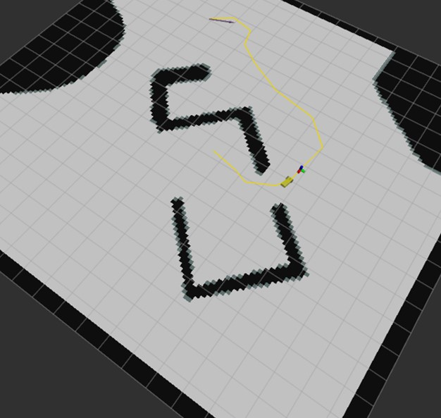
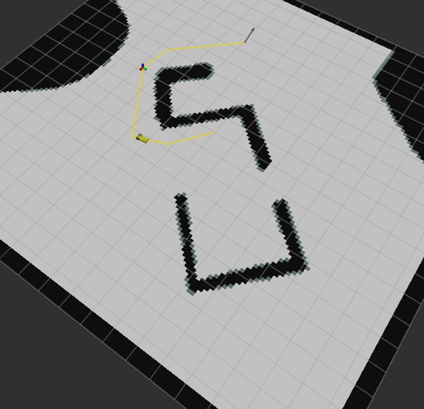

# Robotics-Labs

This repo maintains several robotics labs I've done in zju.

## Trajectory planning for mobile robots
I implemented several algorithms in the trajectory planning of mobile robots. They're:
- Path planning: The Rapidly exploring Random Tree(RRT) and RRT* algorithms
- Estimation: The Iterative Closest Point (ICP) algorithm
- Localization: The extended Kalman filter (EKF) algorithm

After that, I combined them and simulated robot navigation and obstacle avoidance in the Gazebo.

|  |  |

## Posistion control for drones
My groupmates and I built a drone from scratch and applied the proportional–integral–derivative (PID) algorithm to control the drone to hover in the air and could resist a certain amount of interference.

The video is a little bit noisy, please lower the volume ahead.

<video src="videos/drone.mp4" width="600px" controls="controls"></video>

## Motion Planning for robotic arms 
We model the robot arm by positive kinematics and use inverse kinematics to solve the position and pose of the robot arm to control it to follow a given route.

<video src="videos/arm.mp4" width="600px" controls="controls"></video>
